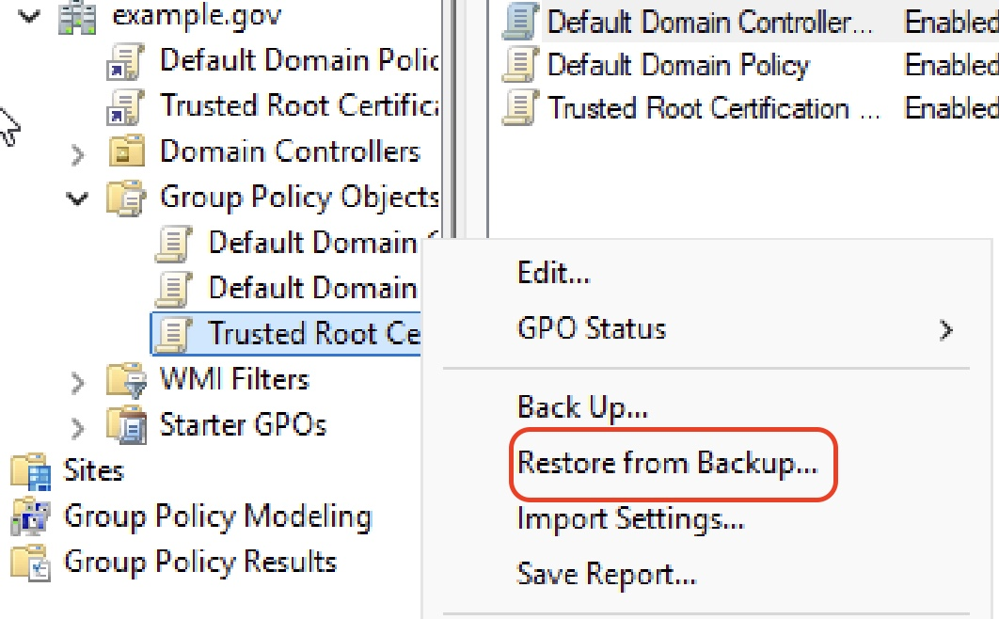
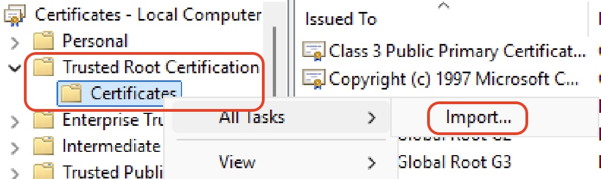

# Consuming Trust

Each truststore is used in a different way. 

## Group Policy
This provides system-wide truststore that is distributed to an entire AD domain, or select Organizational Units within an AD domain. Note, operationalizing this truststore requires Domain Administrator access, as well as the ability to log into and perform work on an AD Domain Server. 

To use this truststore, 
1. Copy the folder and all its contents to an AD Domain Server (also called AD Domain Controller). 
2. Then open the Group Policy Management MMC snap-in. In the appropriate forest, navigate to the domain where this will be deployed. 
3. Open the folder "Group Policy Objects" and then right-click the GPO where this will be restored, and click "Restore From Backup".
   1. If there is not an appropriate GPO to restore into, create a GPO called "Trusted Root Certification Authorities" and leave its contents blank.

4. Follow the Restore Group Policy Object Wizard, to import the folder you copied in step #1.
5. Link the imported GPO to the appropriate OU folder in the selected domain. 
   1. Note, in most cases, this should be linked to the domain apex (the domain itself, and not an OU within the domain).

## Java KeyStore (JKS)
This provides a truststore in the form of a Java Keystore. This truststore is meant to be used by a Java application. 

To use this truststore,
1. Place the JKS file in the folder where the Java application resides, and name the JKS file "cacerts".
2. Configure the Java application to use the truststore.
   1. For Tomcat, edit your server.xml file, to update two values:
      * truststoreFile: Set this to the full path to the cacerts file you placed in step #1
      * truststorePass: Set this to the password for the JKS file. By default, this will be "changeit". 
    2. For a standalone Java application, you can specify the truststore in code:
        ````java
        System.setProperty("javax.net.ssl.trustStore", "/path/to/your/truststore.jks");
        System.setProperty("javax.net.ssl.trustStorePassword", "your_truststore_password");
        ````
    or as a runtime definition that's passed to the JVM:
      ```console
        java \
         -Djavax.net.ssl.trustStore=/path/to/your/truststore.jks \
         -Djavax.net.ssl.trustStorePassword=your_truststore_password \
         YourApplicationMainClass
      ```
        

## PKCS#12 (PFX)
This truststore can be used in a couple of ways. 

Firstly, it can be directly used the same way as a JKS by a Java application. You may need to add an additional configuration, ````trustStoreType=PKCS12````. 

Secondly, if you are using WebSphere Application Server from IBM, the PKCS#12 file can be named "trust.p12" and placed in the "config/cells/<cell_name>/nodes/<node_name>" folder, where it will be used as the default truststore by applications running under WebSphere Application Server.

Finally, it can be imported into Windows in the LocalComputer's "Trusted Root Certification Authorities"



## RedHat System (RPM)
This RPM package is meant to be installed into a RedHat (or RedHat-alike, such as CentOS or Fedora Core) system. It will install the trusted certificates into the system's truststore, which will provide trust information to virtually all languages, runtimes, and applications running inside the RedHat system. 

## Concatenated PEM
This is for consumption by OpenSSL or other PKI libraries that take a single text file that contains a simple list of trusted certificates. 
