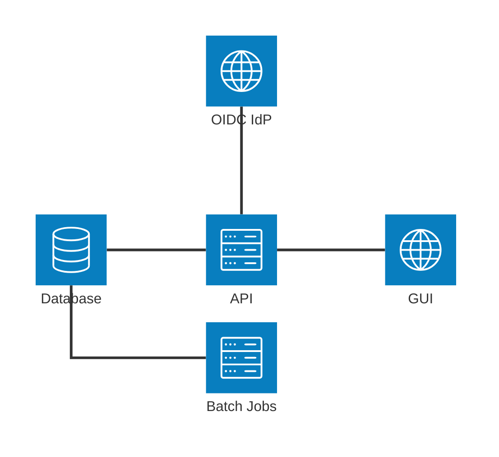
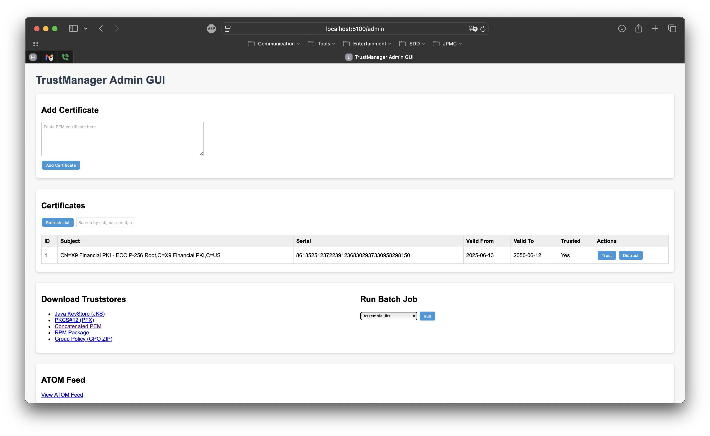

# TrustManager API

TrustManager API is a tool to help enterprises and agencies organize, govern, and manage roots of trust for a PKI in a consistent manner. At its core, TrustManager API is a simple RESTful API built using Flask, which manages trust for digital certificates. The API allows users to add, retrieve, and manage certificates, including toggling their trust status. It further provides a feed of trusted certificates, enabling application/platform/server owners to get notified of trust changes. Lastly, TrustManager API includes batch jobs to build truststores in common formats/structures, to easily communicate trust to applications and operating systems.

## Project Structure

```PlainText
flask-certificates-api
├── src
│   ├── app.py                   # Entry point of the application
│   ├── models
│   │   └── certificates.py      # Defines the Certificate model
│   ├── routes
│   │   └── certificates.py      # Contains route handlers for API endpoints
│   ├── db
│   │   └── database.py          # Handles SQLite database connection and operations
│   ├── batch
│   │   ├── assemble_jks.py          # Batch job: builds Java KeyStore from trusted certs
│   │   ├── assemble_pfx.py          # Batch job: builds PKCS#12 (PFX) from trusted certs
│   │   ├── assemble_trusted_pem.py  # Batch job: concatenates trusted certs as PEM
│   │   ├── assemble_rpm.py          # Batch job: builds RPM package for trusted certs
│   │   └── assemble_group_policy.py # Batch job: builds GPO/Group Policy truststore
│   └── static
│       ├── index.html           # Web-based admin GUI
│       ├── app.js               # JavaScript for the admin GUI
│       ├── style.css            # CSS for the admin GUI
│       ├── swagger.yaml         # OpenAPI/Swagger specification
│       ├── trusted_certs.jks    # Generated Java KeyStore (JKS)
│       ├── trusted_certs.pfx    # Generated PKCS#12 (PFX)
│       ├── trusted_certs.pem    # Concatenated PEM file
│       └── trusted-certs-1.0.0-1.noarch.rpm # Generated RPM package
├── requirements.txt             # Lists project dependencies
├── Dockerfile                   # Docker container definition
├── license.txt                  # Project license
└── README.md                    # Documentation for the project
```



## Authentication and Authorization

TrustManager-API can require AuthN|Z for non-GET endpoints. By default, AuthN|Z is disabled, but can be enabled and configured at run-time.  Authentication is handled by OpenID Connect, and authorization information is taken from the "Roles" assertion in the OIDC claim JWT (which needs to be a bearer-token). When AuthN|Z is enabled, all endpoints with write methods (PUT, POST) require the user to have the role **"TrustAdmin"**. If you turn-on AuthN|Z, then you need to specify the Auth parms; if you are missing any of the Auth parms, it will run with Auth disabled.

## Setup Instructions

### Configuring TrustManager-API

All configuration for the application is taken from the environment as environment variables that start with "TRUSTMANAGER_".

The configurable parms available are:

* TRUSTMANAGER_DATABASE_URL: default "sqlite:///certificates.db"
* TRUSTMANAGER_REQUIRE_AUTH: default "False"
* TRUSTMANAGER_OIDC_CLIENT_ID: default ""
* TRUSTMANAGER_OIDC_CLIENT_SECRET: default ""
* TRUSTMANAGER_OIDC_METADATA_URL: default ""

### Running Containerized

**Note:** This is the recommended way to run this tool. It ensures the running environment has everything you need, and is configured correctly.

1. **Set the configurable parms as exported environment variables:**

   All configuration for the application is taken from the environment as environment variables that start with "TRUSTMANAGER_"

   ```bash
    export TRUSTMANAGER_DATABASE_URL='sqlite:///certificates.db'
    export TRUSTMANAGER_REQUIRE_AUTH=True
    export TRUSTMANAGER_OIDC_CLIENT_ID='TrustManager'
    export TRUSTMANAGER_OIDC_CLIENT_SECRET='asdfghjkl'
    export TRUSTMANAGER_OIDC_METADATA_URL='http://idp.example.gov/oidc/provider/default/.well-known/openid-configuration'
   ```

2. **Build the container image, using the Dockerfile in the current folder:**

   ```bash
    docker build -t trustmanager-api . 
   ```

3. **Run the container, passing-in the configurable parms exported above:**

   You can read more about passing environment variables from your host to your container at [https://docs.docker.com/reference/cli/docker/container/run/#env]

   ```bash
    docker run \
        -d \
        -p 5100:5100 \
        --env TRUSTMANAGER_DATABASE_URL \
        --env RUSTMANAGER_REQUIRE_AUTH \
        --env RUSTMANAGER_OIDC_CLIENT_ID \
        --env TRUSTMANAGER_OIDC_CLIENT_SECRET \
        --env TRUSTMANAGER_OIDC_METADATA_URL \
        trustmanager-api 
   ```

   The API will listen on port **5100**

### Running Directly On The Command-Line

1. **Clone the repository:**

   ```bash
   git clone <repository-url>
   cd flask-certificates-api
   ```

2. **Create a virtual environment:**

  ```bash
   python -m venv venv
   source venv/bin/activate  # On Windows use `venv\Scripts\activate`
   ```

3. **Install dependencies:**

   ```bash
   pip install -r requirements.txt
   ```

4. **Set the configurable parms as exported environment variables:**

   All configuration for the application is taken from the environment as environment variables that start with "TRUSTMANAGER_"

   ```bash
    export TRUSTMANAGER_DATABASE_URL='sqlite:///certificates.db'
    export TRUSTMANAGER_REQUIRE_AUTH=True
    export TRUSTMANAGER_OIDC_CLIENT_ID='TrustManager'
    export TRUSTMANAGER_OIDC_CLIENT_SECRET='asdfghjkl'
    export TRUSTMANAGER_OIDC_METADATA_URL='http://idp.example.gov/oidc/provider/default/.well-known/openid-configuration'
   ```

5. **Run the application:**

   ```bash
   python src/app.py
   ```

   The API will listen on port **5100**.

## API Endpoints

### 1. Add a Certificate

* **Endpoint:** `PUT /Certificate`
* **Description:** Accepts a PEM-encoded certificate, extracts necessary fields, computes the fingerprint, and stores the data in the database.
* **Request Body:** PEM-encoded certificate.

### 2. Retrieve Certificates

* **Endpoint:** `GET /Certificates`
* **Description:** Returns a JSON-encoded list of all certificates with their metadata.

### 3. Trust a Certificate

* **Endpoint:** `POST /Trust`
* **Description:** Marks a certificate as trusted (only if self-signed) and updates the LastChanged time.
* **Request Body:** Certificate ID.

### 4. Distrust a Certificate

* **Endpoint:** `POST /Distrust`
* **Description:** Marks a certificate as not trusted and updates the LastChanged time.
* **Request Body:** Certificate ID.

### 5. ATOM Feed of Trusted Certificates

* **Endpoint:** `GET /Certificates/atom`
* **Description:** Returns an ATOM XML feed of all certificates currently marked as trusted. The feed is updated automatically whenever a certificate is added or its trust status changes.

### 6. Retrieve Certificate by Serial

* **Endpoint:** `GET /Certificate/serial/{serial}`
* **Description:** Retrieve a certificate by its serial number.
* **Response:** PEM-encoded certificate.

### 7. Retrieve Certificate(s) by Subject

* **Endpoint:** `GET /Certificate/subject/{subject}`
* **Description:** Retrieve certificate(s) by full or partial subject match.
* **Response:** List of PEM-encoded certificates.

### 8. Retrieve Certificate by Fingerprint

* **Endpoint:** `GET /Certificate/fingerprint/{fingerprint}`
* **Description:** Retrieve a certificate by its fingerprint.
* **Response:** PEM-encoded certificate.

### 9. Run a Batch Job

* **Endpoint:** `POST /BatchJob`
* **Description:** Initiate a batch job by name (such as building truststores).
* **Request Body:**  

  ```json
  { "job": "<job_name>" }
  ```

* **Available jobs:**  
  * `assemble_jks`
  * `assemble_pfx`
  * `assemble_trusted_pem`
  * `assemble_rpm`
  * `assemble_group_policy`
* **Response:** JSON with job output or error.

### 10. List Available Batch Jobs

* **Endpoint:** `GET /BatchJob/list`
* **Description:** Returns a list of available batch job names that can be executed via the API.
* **Response:**  

  ```json
  ["assemble_jks", "assemble_pfx", "assemble_trusted_pem", "assemble_rpm", "assemble_group_policy"]
  ```

## Batch Jobs

Batch jobs are provided in the `src/batch` directory to export trusted certificates in various formats:

* **assemble_jks.py:**  
  Builds a Java KeyStore (JKS) containing all trusted certificates as root CAs.

* **assemble_pfx.py:**  
  Builds a PKCS#12 (PFX) bundle containing all trusted certificates as root CAs.

* **assemble_trusted_pem.py:**  
  Concatenates all trusted certificates into a single PEM file, with each certificate preceded by its subject and expiration date.

* **assemble_rpm.py:**  
  Builds an RPM package that installs all trusted certificates as separate files in `/etc/pki/ca-trust/source/anchors` on a target machine, and runs `update-ca-trust enable` and `update-ca-trust extract` to update the system trust store. Each certificate file is installed with owner `root`, group `root`, and permissions `0644`.

## Examples

### Adding a Certificate

```bash
curl -X PUT -d "<PEM_CERTIFICATE>" http://localhost:5100/Certificate
```

### Retrieving Certificates

```bash
curl -X GET http://localhost:5100/Certificates
```

### Trusting a Certificate

```bash
curl -X POST -H "Content-Type: application/json" -d '{"id": 1}' http://localhost:5100/Trust
```

### Distrusting a Certificate

```bash
curl -X POST -H "Content-Type: application/json" -d '{"id": 1}' http://localhost:5100/Distrust
```

### Getting the ATOM Feed

```bash
curl -X GET http://localhost:5100/Certificates/atom
```

### Running a Batch Job

```bash
curl -X POST -H "Content-Type: application/json" -d '{"job": "assemble_jks"}' http://localhost:5100/BatchJob
```

### Retrieving a Certificate by Serial

```bash
curl -X GET http://localhost:5100/Certificate/serial/123456789
```

### Retrieving Certificates by Subject

```bash
curl -X GET http://localhost:5100/Certificate/subject/Example
```

### Retrieving a Certificate by Fingerprint

```bash
curl -X GET http://localhost:5100/Certificate/fingerprint/abcdef123456
```

### Listing Available Batch Jobs

```bash
curl -X GET http://localhost:5100/BatchJob/list
```

## Web-based Admin GUI

A simple web GUI is available for administrators at [http://localhost:5100/admin](http://localhost:5100/admin).




**Features:**

* Add new certificates
* View and search all certificates
* Trust/distrust certificates (with self-signed check)
* Download truststore files (JKS, PFX, PEM, RPM)
* View ATOM feed of trusted certificates

**How to use:**

1. Start the Flask API.
2. Open [http://localhost:5100/admin](http://localhost:5100/admin) in your browser.
3. Use the interface to manage certificates and truststores.

Static files for the GUI are located in the `static/` folder.

## License

This project is licensed under the [BSD License](license.txt).

Swagger (interactive API documentation) licensed under the terms [here](https://swagger.io/license/)
